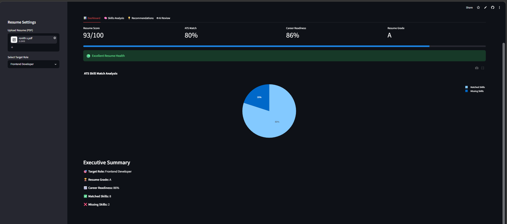
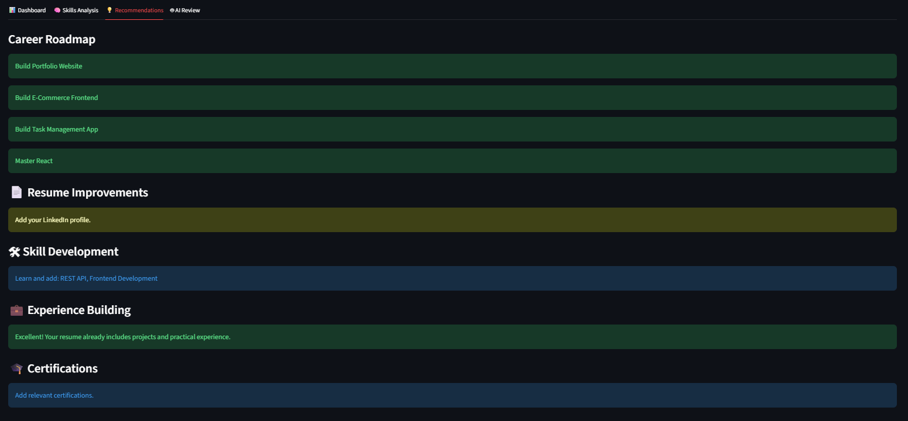
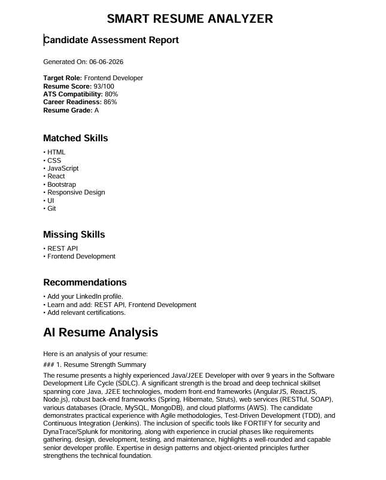

# Smart Resume Analyzer

## Overview

Smart Resume Analyzer is an AI-powered web application that evaluates resumes, calculates ATS compatibility scores, identifies missing skills, generates career recommendations, and provides detailed AI-powered feedback using Google Gemini.

---

## Features

* Resume PDF Upload
* Resume Score Analysis
* ATS Compatibility Analysis
* Skill Gap Identification
* Smart Feedback System
* Career Readiness Score
* Resume Grading System
* AI-Powered Resume Review
* PDF Report Generation
* Interactive Dashboard

---

## Technology Stack

### Frontend

* Streamlit

### Backend

* Python

### AI Integration

* Google Gemini API

### Data Processing

* PyPDF2
* Pandas

### Visualization

* Plotly

### Reporting

* ReportLab

---

## Project Workflow

1. Upload Resume
2. Extract Resume Text
3. Calculate Resume Score
4. Perform ATS Analysis
5. Identify Missing Skills
6. Generate Recommendations
7. Generate AI Review
8. Export PDF Report

---

## Installation

```bash
pip install -r requirements.txt
streamlit run app.py
```

---

## Future Scope

* Job Description Upload
* Resume Ranking System
* LinkedIn Profile Analysis
* Interview Question Generator
* AI Career Coach

---

## Screenshots

### Dashboard


### Skills Analysis


### Recommendations


### AI Review


### PDF Report


---

## Author

Manya Morakhia
